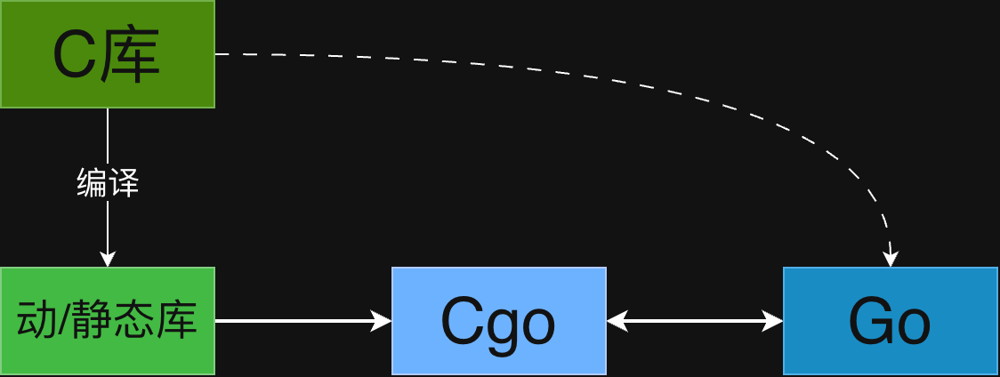
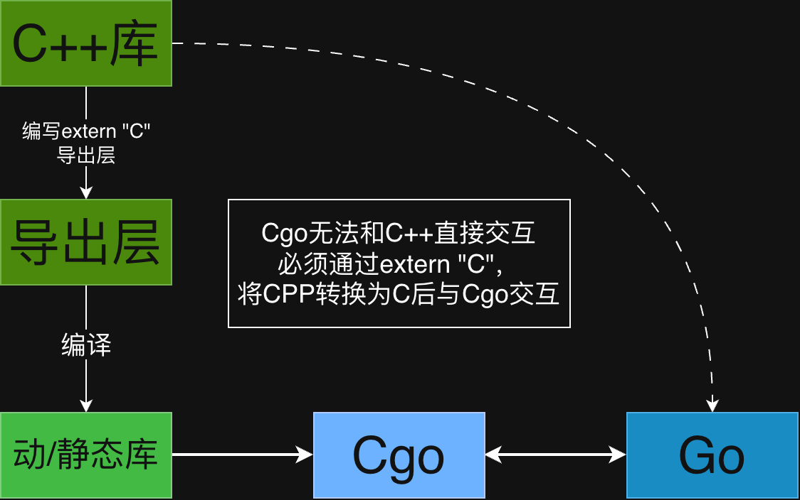

余佳璟@2026/07/10 09:37

[工程示例](https://github.com/YUJIAJING0408/study_cgo)

---

# 入门

Golang提供了和C语言交互的能力，通过自带的Cgo模块可以实现快速的现有C/CPP代码访问。



## 简单示例

```Go
package main

/*
#include <stdio.h>
#include <stdlib.h>
void hello_from_c(const char* name){
	printf("hello %s from C\n",name);
}

*/
import "C"
import "unsafe"

func main() {
	name := "Golang"
	cStr := C.CString(name) // 类型转换成C字符数组
	defer C.free(unsafe.Pointer(cStr)) // 释放
	C.hello_from_c(cStr) // 调用
}
```

上述为一个最简单的Cgo调用，但是对于刚接触Cgo的开发者还存在一些疑惑

1. 为什么Go字符串需要转换成C字符串？

    根本原因是Go和C对字符串定义不一样

    - Go

        字符串底层为结构体，包含两个字段（16字节）

        1. 指针`Pointer`，指向存储字符的数组

        2. 长度`int64`，记录长度

    - C

        它就是一个**指针**（`char*`），指向内存中的第一个字符。C 语言**不记录长度**，而是靠读取到内存中的 `'\0'`（空字节）来判断字符串是否结束。

1. 为什么需要使用`C.free`延迟释放掉申请的C字符数组？

    堆内存机制的不同带来的问题

    - Go

        GC的存在可以最大程度避免Go开发者手动管理堆内存配合上编译期逃逸分析，尽可能减少了C/CPP中存在的UAF问题（Use After Free）。

    - C/CPP

        对堆内存手动控制，申请释放由开发者控制

        - **生命周期**：由你决定。只要不调用 `free` 或 `delete`，这块内存会一直存在，直到进程结束（期间会造成内存泄漏）。

        - **为何要手动**：因为编译器不知道你要存的数据活多久。比如你要在函数里创建一个对象，并希望它返回给调用者后依然存在，那只能放在堆上。

    **`C.CString`** 是在 C 的堆上复制了一份GoString的数据，Go 拥有这份数据的“生杀大权”（必须负责释放），但无法监控 C 侧何时用完，因此只能遵循“同步调用 + 延迟释放”的规则，来保证内存生命周期的安全。

    - **Go 的 GC 管不了 C 的堆**，C 侧的内存完全独立于 Go 的运行时。

    - **C 标准库（如 `printf`）是“只读消费者”**，它只会读取数据，绝不会、也没有义务替你释放传入的指针。

    因此，**“谁申请，谁释放”** 的责任必须由发起申请的 Go 侧承担到底。而 `defer C.free()` 正是这一铁律的最佳落地——它确保释放责任落在申请者（Go）身上，且无论函数如何返回，都能在 C 同步执行完毕后安全回收内存，不给悬挂指针留下任何空间。

## 工程化示例

通常在Go中需要做的事是对已有的C代码进行封装调用，而不是重复造轮子，例如上述的简单Cgo示例中明明Go已经具备控制台输出能力，却非要调用C的printf。这种操作实际上没有任何意义，因为Cgo存在两面性：

- 优点

    - 打通C和Go间隔离，使Go可以兼容C的代码，协同工作，避免遭重复轮子

    - Go手动控制内存，高性能计算避免GC瓶颈

- 缺点

    - Cgo本身存在性能开销是平衡是否使用它的关键因素

    - Cgo代码编写、环境依赖和交叉编译都较为复杂，极易产生各种问题

    - 线程安全、异步调用等问题

通常场景下不会将C代码写在Go文件中，这样不方便管理，更工程化的开发方式是通过`#include`导入和`Makefile`项目管理。

### 简单工程化实践（静态库调用）

```Plain Text
go-wrapper/
├── csrc/                      # C/C++ 源码（封装层和第三方补丁）
│   └── sdk.c
├── lib/                       # Makefile编译生成二进制库文件
│   └── libsdk.a
├── include/                   # 公共头文件（可被外部使用）
│   └── api.h
├── pkg/                       # Go 封装层（核心）
│   └── gosdk/
│       └── wrapper.go
├── main.go
└── Makefile                   # 项目编译
```

```C
#include <stdio.h>
#include "api.h"

int add(int a, int b) {
    return a + b;
}

void greet(const char* name) {
    printf("Hello, %s from C!\n", name);
}
```

```C
#ifndef API_H
#define API_H

int add(int a, int b);
void greet(const char* name);

#endif
```

```Go
package gosdk

/*
#cgo CFLAGS: -I${SRCDIR}/../../include
#cgo LDFLAGS: -L${SRCDIR}/../../lib -lsdk
#include <stdlib.h>
#include <api.h>
*/
import "C"
import "unsafe"

func Add(a, b int32) int32 {
	return int32(C.add(C.int(a), C.int(b)))
}

func Greet(name string) {
	nameCStr := C.CString(name)
	defer C.free(unsafe.Pointer(nameCStr))
	C.greet(nameCStr)
}

```

```MakeFile
LIB_NAME = sdk
LIB_FILE = lib/lib$(LIB_NAME).a
TARGET = main
CFLAGS = -Iinclude

all: $(LIB_FILE) $(TARGET) run

$(LIB_FILE): csrc/sdk.c include/api.h | lib
	gcc -c $(CFLAGS) csrc/sdk.c -o temp.o
	ar rcs $@ temp.o
	rm temp.o

$(TARGET):
	go build -o $(TARGET) main.go

lib:
	mkdir -p lib

run:
	./$(TARGET)

clean:
	rm -rf lib $(TARGET) *.o
```

### 动态库示例

同理静态库调用，编译出的so文件的sdk封装与静态库完全一致

```MakeFile
LIB_NAME = sdk
STATIC_LIB_FILE = lib/static/lib$(LIB_NAME).a
DYNAMIC_LIB_FILE = lib/dynamic/lib$(LIB_NAME).so
CFLAGS = -Iinclude
# 动态库需要 -fPIC
SHARED_CFLAGS = $(CFLAGS) -fPIC
TARGET = main


all: clean $(STATIC_LIB_FILE) $(DYNAMIC_LIB_FILE) $(TARGET) run

$(STATIC_LIB_FILE): csrc/sdk.c include/api.h | lib
	gcc -c $(CFLAGS) csrc/sdk.c -o temp.o
	ar rcs $@ temp.o
	rm temp.o

$(DYNAMIC_LIB_FILE): csrc/sdk.c include/api.h | lib
	gcc -c $(SHARED_CFLAGS) $< -o temp.o
	gcc -shared -o $@ temp.o
	rm -f temp.o

$(TARGET):
	go build -o $(TARGET) main.go

lib:
	mkdir -p lib/dynamic
	mkdir -p lib/static

run:
	./$(TARGET)

clean:
	rm -rf lib $(TARGET) *.o
```

注意使用动态链接，必须保证动态库可以被可执行文件找到，动态库搜索路径顺序（Linux）：

1. **编译时指定的 `-rpath` 或 `-rpath-link` 路径**（如果有，且被嵌入到可执行文件中）。

2. **环境变量 `LD_LIBRARY_PATH`** 中指定的目录（以冒号分隔）。

3. **默认系统库路径**：`/lib`、`/usr/lib` 等（根据 `/etc/ld.so.conf` 配置）。

4. **当前工作目录**（即 `./`）通常**不在**默认搜索路径中（除了一些特殊配置，一般不会自动搜索当前目录）。

## CPP调用？

这个问题的核心在于 Go 的 CGO 机制只兼容 C 语言的调用约定（稳定ABI）和符号规则，而 C++ 的 ABI 和符号规则要复杂得多。

- 为什么 Go 能直接调用 C？

    1. **C 的 ABI 稳定**：C 语言的函数调用约定（如参数传递、栈帧布局、返回值处理）在各个平台都有标准规范（如 System V ABI），且几乎不变。这使得 Go 的 CGO 能够准确生成调用 C 函数的指令序列。

    2. **C 的符号简单**：C 函数的符号名就是函数名本身（例如 `add` → `_add` 或 `add`），没有额外修饰，链接器可以轻松找到。

    3. **C 运行时轻量**：C 语言不需要运行时环境（没有构造/析构、异常处理、RTTI），调用 C 函数只需直接跳转到函数地址即可。

- 为什么 Go 不能直接调用 C++？

    1. **C++ 的名称修饰（Name Mangling）**
C++ 支持函数重载，因此编译器会对函数名进行修饰（例如 `void foo(int)` 可能变为 `_Z3fooi`），使得链接器看到的是修饰后的符号。Go 无法预知修饰规则，也无法直接解析这些符号。

    2. **C++ 的 ABI 不统一**
C++ 标准没有规定二进制接口（ABI），不同的编译器（g++、clang）、甚至同一编译器的不同版本，都可能使用不同的 ABI（如 Itanium ABI、ARM ABI）。这使得 Go 无法生成与所有 C++ 代码兼容的调用指令。



Go 不能直接调用 C++ 函数，但可以通过一个 **C 包装层（wrapper）** 来实现：

1. 在 C++ 代码中使用 `extern "C"` 将需要暴露给 Go 的函数声明为 **C 链接**，这样编译器会生成符合 C ABI 的符号（不进行名称修饰）。

2. 在这个导出层内部，调用真正的 C++ 代码。

3. Go 的 CGO 只与这个导出层交互，就像调用普通 C 函数一样。

### 工程化示例

```Plain Text
go-wrapper/
├── csrc/                      # C/C++ 源码（封装层和第三方补丁）
│   ├── sdk.cpp                # sdk库
│   └── wrapper.cpp            # extern "C" 导出层
├── lib/                       # Makefile编译生成二进制库文件
│   └── libsdk.a
├── include/                   # 公共头文件（可被外部使用）
│   ├── sdk.hpp                # sdk库的类定义
│   └── wrapper.h              # 与 wrapper.cpp 中的声明一致（C 接口）
├── pkg/                       
│   └── gosdk/                 # Go 封装层（核心）
│       └── wrapper.go
├── main.go
└── Makefile                   # 项目编译
```

```C++
#include "sdk.hpp"
#include <iostream>

int Calculator::add(int a, int b) {
    return a + b;
}

void Calculator::greet(const std::string& name) {
    std::cout << "Hello, " << name << " from C++!" << std::endl;
}
```

```C++
#include "sdk.hpp"
#include <string>

// 使用 extern "C" 阻止 C++ 名称修饰，使函数按 C 方式导出
extern "C" {

// 定义一个不透明指针（隐藏 C++ 对象细节）
typedef void* CalculatorHandle;

// 创建 Calculator 对象，返回句柄
CalculatorHandle Calculator_new() {
    return new Calculator();
}

// 删除对象
void Calculator_delete(CalculatorHandle handle) {
    delete static_cast<Calculator*>(handle);
}

// 调用 add 方法
int Calculator_add(CalculatorHandle handle, int a, int b) {
    Calculator* calc = static_cast<Calculator*>(handle);
    return calc->add(a, b);
}

// 调用 greet 方法（接收 C 字符串）
void Calculator_greet(CalculatorHandle handle, const char* name) {
    Calculator* calc = static_cast<Calculator*>(handle);
    std::string str(name);
    calc->greet(str);
}

} // extern "C"
```

```C++
#ifndef SDK_HPP
#define SDK_HPP

#include <string>

class Calculator {
public:
    int add(int a, int b);
    void greet(const std::string& name);
};

#endif
```

```C
#ifndef WRAPPER_H
#define WRAPPER_H

// 与 wrapper.cpp 中的声明一致（C 接口）
typedef void* CalculatorHandle;

CalculatorHandle Calculator_new();
void Calculator_delete(CalculatorHandle handle);
int Calculator_add(CalculatorHandle handle, int a, int b);
void Calculator_greet(CalculatorHandle handle, const char* name);

#endif
```

```Go
package sdk

/*
#cgo CFLAGS: -I${SRCDIR}/../../include
#cgo LDFLAGS: -L${SRCDIR}/../../lib -lsdk -lstdc++
#include <stdlib.h>
#include <wrapper.h>
*/
import "C"
import (
	"fmt"
	"unsafe"
)

type Sdk struct {
	h C.CalculatorHandle
}

func NewSdk() *Sdk {
	return &Sdk{
		h: C.Calculator_new(),
	}
}

func (sdk *Sdk) Add(a, b int32) int32 {
	if sdk.h == nil {
		panic("Sdk not initialized Or Free")
	}
	return int32(C.Calculator_add(sdk.h, C.int(a), C.int(b)))
}

func (sdk *Sdk) Greet(name string) {
	if sdk.h == nil {
		panic("Sdk not initialized Or Free")
	}
	nameCStr := C.CString(name)
	defer C.free(unsafe.Pointer(nameCStr))
	C.Calculator_greet(sdk.h, nameCStr)
}

func (sdk *Sdk) Free() {
	C.Calculator_delete(sdk.h)
	sdk.h = nil
	fmt.Println("Sdk Free")
}

```

```Go
package main

import (
	"fmt"
	"study_cgo/example/simple_cgo5/pkg/sdk"
)

func main() {
	s := sdk.NewSdk()
	fmt.Printf("1 + 10 = %d\n", s.Add(1, 10))
	s.Greet("Go")
	s.Free()
}

```

```MakeFile
LIB_NAME = sdk
LIB_FILE = lib/lib$(LIB_NAME).a
CFLAGS = -Iinclude
CXX_FLAGS = -Wall -O2 -Iinclude
LDFLAGS = -lstdc++
TARGET = main
CPP_SRCS = csrc/sdk.cpp csrc/wrapper.cpp

all: clean $(LIB_FILE) $(TARGET) run

$(LIB_FILE): $(CPP_SRCS) include/sdk.hpp include/wrapper.h | lib
	g++ $(CFLAGS) -c csrc/sdk.cpp -o sdk.o
	g++ $(CFLAGS) -c csrc/wrapper.cpp -o wrapper.o
	ar rcs $@ sdk.o wrapper.o
	rm sdk.o wrapper.o

$(TARGET):
	go build -o $(TARGET) main.go

lib:
	mkdir -p lib

run:
	./$(TARGET)

clean:
	rm -rf lib $(TARGET) *.o
```

本质上来说流程和C与Cgo交互区别不大，也是先编译出库文件，再通过Cgo交互。**那么为什么不直接通过C++直接导出库文件？**

答案实际上还是在ABI上，**即使最终产物是 `.a` 静态库，Go 仍然需要 C 风格的符号名**，因为 CGO 基于 C 的 ABI 和符号规则。**不写 `extern "C"`，C++ 编译器会进行名称修饰**，导致 Go 找不到符号。**唯一的例外是**：如果你使用的 C++ 编译器恰好没有修饰（几乎不可能），或者你强行在 Go 中声明修饰后的名字（不现实），否则你无法避免使用 `extern "C"`。


